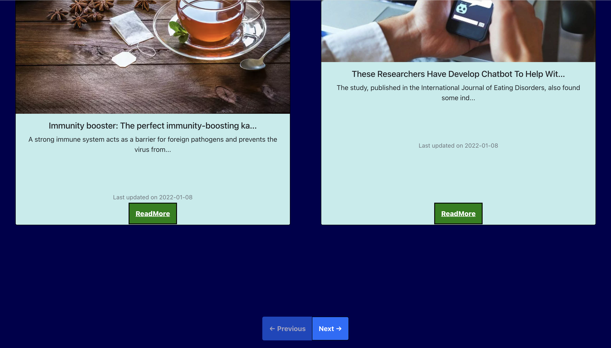

# AnytimeNews

## OVERVIEW
The purpose of the project is to develop a ***real-time responsive*** application which will display **news articles***. 
User can browse news articles through various ***categories***. 
App will enable user to view news details, images, and video. 

## TECHNICAL
***API USED:*** NEWSAPI  
***TECHNOLOGIES USED:*** HTML , CSS , VANILLA JAVASCRIPT, REACTJS(JS LIBRARY), BOOTSTRAP(CSS FRAMEWORK). 

## IMAGES
<kbd>

</kbd>
*** ***
<kbd>

</kbd>
*** ***
<kbd>

  </kbd>

## IMAGES SMALL DEVICES
<kbd>

</kbd>
*** ***
<kbd>

</kbd>

