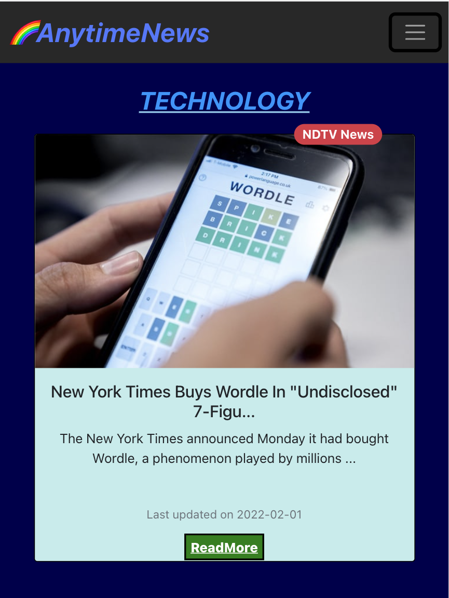

# AnytimeNews
 
 

### Video

<a href="https://drive.google.com/file/d/1c5bDoC874X_gmkZkBjmkJf7w22jW5XhV/view?usp=sharing">Anytime-News Video Link</a>
 
  
## FLOW OF README FILE 
*Overview of project  
*Technical  
*Images 
*Small device Images 
*Flow of Code 

## OVERVIEW
*The purpose of the project is to develop a ***real-time responsive*** application which will display **news articles***. 
*User can browse news articles through various ***categories***. 
*App will enable user to view news details, images, and videos. 
 
***THEMES**: DARK / LIGHT
 

## TECHNICAL
***API USED:*** 
NEWSAPI  

***TECHNOLOGIES USED:*** 
 HTML  
 CSS   
 VANILLA JAVASCRIPT  
 REACTJS (JS LIBRARY)  
 BOOTSTRAP (CSS FRAMEWORK)
 

## IMAGES

*** ***
<kbd align="center">

</kbd>

*** ***

  

  
  *** ***

  

  
  *** ***

  

 
 

## IMAGES SMALL DEVICES
 **SAMSUNG DUO**  

 

*** ***
 **PIXEL 5**  

 

*** ***
 **IPHONE SE**  

 

## FLOW OF CODE

**ReadmePictures** 
Contains screenShots of application in Computer and Small devices. 
 

**./src/app.js** 
All components are put together. 
Default image url is also given,if image url is null.  
 

**./src/app.css** 
All external css of the code. 
 

**./src/components** 
Contains all the components of the code such as navbar etc. 
 

**./src/components/NavBar.js** 
Returns Navbar code of the code. 
 

**./src/components/NewsCard.js** 
URL is url of API. 
Returns NewsCard with title limit of 50 characters & description limit of 90 characters. 
Also returns other components of page like previous/next page button if available. 
 

 **./src/components/Loading.js** 
 Conatins Loading animation gif. 
  

 

